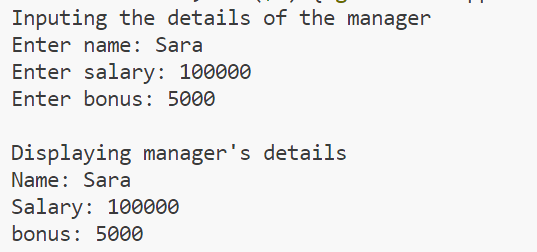
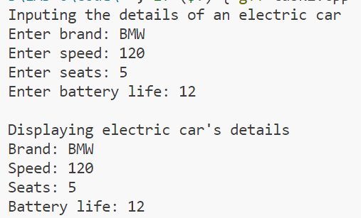
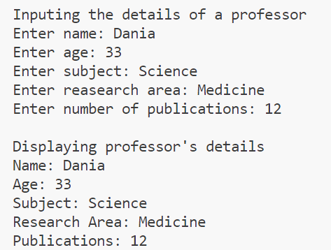
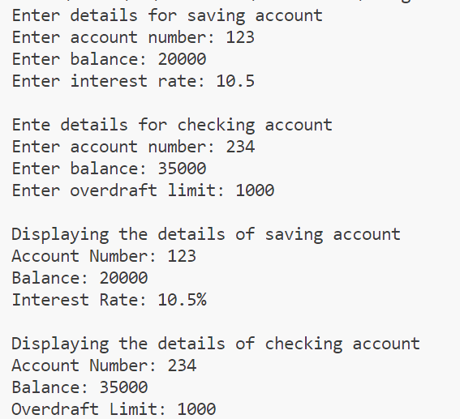
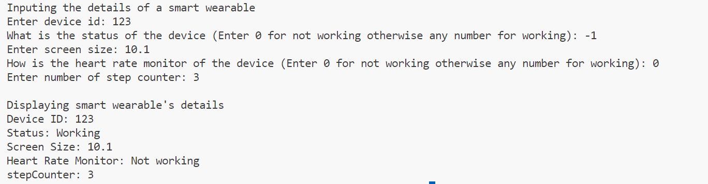

# OOP-LAB6-24K-0762

# C++ Code Repository

## Preview
Here are the sample outputs of the programs:

### Task 1 Output:


### Task 2:


### Task 3:


### Task 4:


### Task 5:



---

## Code
Below are the C++ programs:

### Program 1: 
```cpp

#include<iostream>
using namespace std;
class Employee{
    public:
        string name;
        float salary;
        Employee(string name,float sal):name(name),salary(sal){}
        void displayDetails(){
            cout<<"Name: "<<name<<endl<<"Salary: "<<salary<<endl;
        }
};
class Manager: public Employee{
    float bonus;
    public:
        Manager(string name,float sal,float b):Employee(name,sal),bonus(b){}
        void displayDetails(){
           Employee::displayDetails();
           cout<<"bonus: "<<bonus<<endl;
        }
};
int main(){
    string name;
    float salary;
    float bonus;
    cout<<"Inputing the details of the manager"<<endl;
    cout<<"Enter name: ";
    cin>>name;
    cout<<"Enter salary: ";
    cin>>salary;
    cout<<"Enter bonus: ";
    cin>>bonus;
    Manager m(name,salary,bonus);
    cout<<endl<<"Displaying manager's details"<<endl;
    m.displayDetails();
    return 0;
}


## Code
Below are the C++ programs:

### Program 2: 
```cpp
#include<iostream>
using namespace std;
class Vehicle{
    string brand;
    int speed;
    public:
        Vehicle(string brand,int speed):brand(brand),speed(speed){}
        void displayDetails(){
            cout<<"Brand: "<<brand<<endl<<"Speed: "<<speed<<endl;
        }
};
class Car: public Vehicle{
    int seats;
    public:
        Car(string brand,int speed,int seats):Vehicle(brand,speed),seats(seats){}
        void displayDetails(){
            Vehicle::displayDetails();
            cout<<"Seats: "<<seats<<endl;
        }
};
class ElectricCar: public Car{
    int batteryLife;
    public:
        ElectricCar(string brand,int speed,int seats,int life):Car(brand,speed,seats),batteryLife(life){}
        void displayDetails(){
            Car::displayDetails();
            cout<<"Battery life: "<<batteryLife;
        }
};
int main(){
    string brand;
    int speed,seats,battery;
    cout<<"Inputing the details of an electric car"<<endl;
    cout<<"Enter brand: ";
    cin>>brand;
    cout<<"Enter speed: ";
    cin>>speed;
    cout<<"Enter seats: ";
    cin>>seats;
    cout<<"Enter battery life: ";
    cin>>battery;
    ElectricCar e(brand,speed,seats,battery);
    cout<<endl<<"Displaying electric car's details"<<endl;
    e.displayDetails();
    return 0;
}


## Code
Below are the C++ programs:

### Program 3: 
```cpp
#include<iostream>
using namespace std;
class Person{
    string name;
    int age;
    public:
        Person(string name,int a):name(name),age(a){};
        void displayDetails(){
            cout<<"Name: "<<name<<endl<<"Age: "<<age<<endl;
        }
};
class Teacher: virtual public Person{
    public:
        string subject;
        Teacher(string name,int a,string sub):Person(name,a),subject(sub){};
        void displayDetails(){
            Person::displayDetails();
            cout<<"Subject: "<<subject<<endl;
        }
};
class Researcher: virtual public Person{
    public:
        string researchArea;
        Researcher(string name,int a,string area):Person(name,a),researchArea(area){}
        void displayDetails(){
            Person::displayDetails();
            cout<<"Research Area: "<<researchArea<<endl;
        }
};
class Professor: public Teacher,public Researcher{
    int publications;
    public:
        Professor(string name,int a,string sub,string area,int pub):Person(name,a),Teacher(name,a,sub),Researcher(name,a,area),publications(pub){}
        void displayDetails(){
            Person::displayDetails();    
            cout<<"Subject: "<<subject<<endl;
            cout<<"Research Area: "<<researchArea<<endl;
            cout<<"Publications: "<<publications<<endl;
        }
};
int main(){
    int pub,age;
    string name,sub,area;
    cout<<"Inputing the details of a professor"<<endl;
    cout<<"Enter name: ";
    cin>>name;
    cout<<"Enter age: ";
    cin>>age;
    cout<<"Enter subject: ";
    cin>>sub;
    cout<<"Enter reasearch area: ";
    cin>>area;
    cout<<"Enter number of publications: ";
    cin>>pub;
    Professor prof(name,age,sub,area,pub);
    cout<<endl<<"Displaying professor's details"<<endl;
    prof.displayDetails();
    return 0;
}


## Code
Below are the C++ programs:

### Program 4: 
```cpp

#include<iostream>
using namespace std;
class Account{
    int accountNumber;
    float balance;
    public:
        Account(int acc_no,float balance):accountNumber(acc_no),balance(balance){}
        void displayDetails(){
            cout<<"Account Number: "<<accountNumber<<endl;
            cout<<"Balance: "<<balance<<endl;
        }
};
class SavingsAccount: public Account{
    float interestRate;
    public:
        SavingsAccount(int acc_no,float balance,float interest):Account(acc_no,balance),interestRate(interest){}
        void displayDetails(){
            Account::displayDetails();
            cout<<"Interest Rate: "<<interestRate<<"%"<<endl;
        }
};
class CheckingAccount: public Account{
    float overdraftLimit;
    public:
        CheckingAccount(int acc_no,float balance,float limit):Account(acc_no,balance),overdraftLimit(limit){}
        void displayDetails(){
            Account::displayDetails();
            cout<<"Overdraft Limit: "<<overdraftLimit<<endl;
        }
};
int main(){
    int acc_no;
    float balance,rate,limit;
    cout<<"Enter details for saving account"<<endl;
    cout<<"Enter account number: ";
    cin>>acc_no;
    cout<<"Enter balance: ";
    cin>>balance;
    cout<<"Enter interest rate: ";
    cin>>rate;
    SavingsAccount sav_acc(acc_no,balance,rate);
    cout<<endl<<"Ente details for checking account"<<endl;
    cout<<"Enter account number: ";
    cin>>acc_no;
    cout<<"Enter balance: ";
    cin>>balance;
    cout<<"Enter overdraft limit: ";
    cin>>limit;
    CheckingAccount check_acc(acc_no,balance,limit);
    cout<<endl<<"Displaying the details of saving account"<<endl;
    sav_acc.displayDetails();
    cout<<endl<<"Displaying the details of checking account"<<endl;
    check_acc.displayDetails();
    return 0;
}


## Code
Below are the C++ programs:

### Program 5: 
```cpp
#include<iostream>
using namespace std;
class Device{
    bool status;
    int deviceID;
    public:
        Device(int id,bool status):deviceID(id),status(status){};
        void displayDetails(){
            cout<<"Device ID: "<<deviceID<<endl<<"Status: ";
            if(status){
                cout<<"Working";
            }
            else{
                cout<<"Not working";
            }
            cout<<endl;
        }
};
class SmartPhone: virtual public Device{
    public:
        float screenSize;
        SmartPhone(int id,bool status,float size):Device(id,status),screenSize(size){};
        void displayDetails(){
            Device::displayDetails();
            cout<<"Screen Size: "<<screenSize<<endl;
        }
};
class SmartWatch: virtual public Device{
    public:
        bool heartRateMonitor;
        SmartWatch(int id,bool status,bool rate):Device(id,status),heartRateMonitor(rate){}
        void displayDetails(){
            Device::displayDetails();
            cout<<"Heart Rate Monitor: ";            
            if(heartRateMonitor){
                cout<<"Working";
            }
            else{
                cout<<"Not working";
            }
            cout<<endl;    
        }
};
class SmartWearable: public SmartPhone,public SmartWatch{
    int stepCounter;
    public:
        SmartWearable(int id,bool status,bool rate,int counter,float size):Device(id,status),SmartPhone(id,status,size),SmartWatch(id,status,rate),stepCounter(counter){}
        void displayDetails(){
            Device::displayDetails();    
            cout<<"Screen Size: "<<screenSize<<endl;
            cout<<"Heart Rate Monitor: ";
            if(heartRateMonitor){
                cout<<"Working";
            }
            else{
                cout<<"Not working";
            }
            cout<<endl;
            cout<<"stepCounter: "<<stepCounter<<endl;
        }
};
int main(){
    int id,counter,isWorking;
    float size;
    bool heartRateMonitor,status;
    cout<<"Inputing the details of a smart wearable"<<endl;
    cout<<"Enter device id: ";
    cin>>id;
    cout<<"What is the status of the device (Enter 0 for not working otherwise any number for working): ";
    cin>>isWorking;
    if(isWorking==0){
        status=0;
    }
    else{
        status=1;
    }
    cout<<"Enter screen size: ";
    cin>>size;
    cout<<"How is the heart rate monitor of the device (Enter 0 for not working otherwise any number for working): ";
    cin>>isWorking;
    if(isWorking==0){
        heartRateMonitor=0;
    }
    else{
        heartRateMonitor=1;
    }
    cout<<"Enter number of step counter: ";
    cin>>counter;
    SmartWearable wearable(id,status,heartRateMonitor,counter,size);
    cout<<endl<<"Displaying smart wearable's details"<<endl;
    wearable.displayDetails();
    return 0;
}


 


